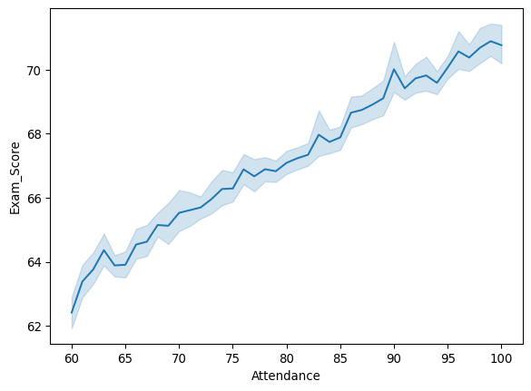
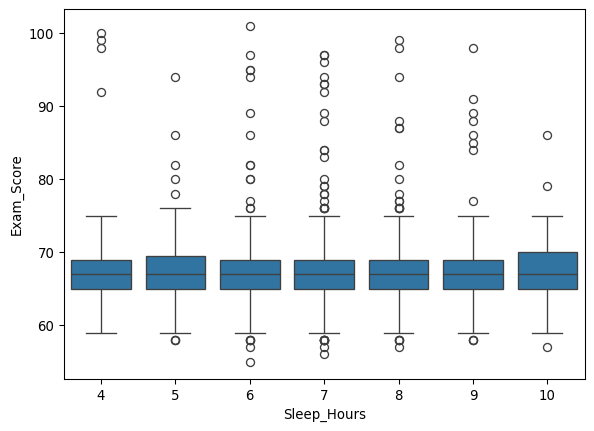

# Final Project
Anna Buffone

## What Factors Affect Exam Scores?

The goal of this project was to see if attendance and sleep hours had an
affect on exam score. I chose to explore this topic because attendance
and sleep hours are a rising issue among students today. To start, I
loaded all packages in needed and read the data in. The data used was
found on Kaggle, “StudentPerformanceFactors.csv”. Within the data there
are 6607 rows and 20 columns.

``` python
import pandas as pd
import numpy as np
import matplotlib.pyplot as plt
import seaborn as sns
import statsmodels.formula.api as smf

student_performance = pd.read_csv("~/Downloads/StudentPerformanceFactors.csv")
student_performance.head()
student_performance.shape
```

    (6607, 20)

After exploring the data, I visualized the relationship between
Attendance and Exam Score. For this I decided on a line plot since both
were continuous numeric variables. The solid blue line shows the average
exam score at each attendance level. The shaded area shows the margin of
uncertainty. There is an upward trend and gets narrow. This indicates a
strong and stable relationship.

``` python
sns.lineplot(x='Attendance', y='Exam_Score', data=student_performance)
```



Next, I visualized the relationship between Sleep Hours and Exam Score.
For this I decided to use a boxplot beacuse they are distinct categories
and the boxplot is ideal for comparing the distribution of exam scores
across these groups. This shows the medians are roughly the same across
all groups, there are outliers in each group, and the spread is also
about the same. Since there are overlaps, there are no clear trends in
this data.

``` python
sns.boxplot(x='Sleep_Hours', y='Exam_Score', data=student_performance)
```



To formally test the variables, the next step was to fit a linear
regression model for each variable.

``` python
student_performance['Exam_Score'].describe()

fit_1 = smf.ols(formula='Exam_Score ~ Attendance', data=student_performance).fit()
fit_1.summary()
```

|                   |                  |                     |           |
|-------------------|------------------|---------------------|-----------|
| Dep. Variable:    | Exam_Score       | R-squared:          | 0.338     |
| Model:            | OLS              | Adj. R-squared:     | 0.338     |
| Method:           | Least Squares    | F-statistic:        | 3367\.    |
| Date:             | Wed, 10 Dec 2025 | Prob (F-statistic): | 0.00      |
| Time:             | 14:00:34         | Log-Likelihood:     | -16989.   |
| No. Observations: | 6607             | AIC:                | 3.398e+04 |
| Df Residuals:     | 6605             | BIC:                | 3.400e+04 |
| Df Model:         | 1                |                     |           |
| Covariance Type:  | nonrobust        |                     |           |

OLS Regression Results

|            |         |         |         |          |         |         |
|------------|---------|---------|---------|----------|---------|---------|
|            | coef    | std err | t       | P\>\|t\| | \[0.025 | 0.975\] |
| Intercept  | 51.5786 | 0.273   | 189.191 | 0.000    | 51.044  | 52.113  |
| Attendance | 0.1958  | 0.003   | 58.026  | 0.000    | 0.189   | 0.202   |

|                |          |                   |            |
|----------------|----------|-------------------|------------|
| Omnibus:       | 4752.483 | Durbin-Watson:    | 2.023      |
| Prob(Omnibus): | 0.000    | Jarque-Bera (JB): | 163501.063 |
| Skew:          | 3.038    | Prob(JB):         | 0.00       |
| Kurtosis:      | 26.601   | Cond. No.         | 566\.      |

<br/><br/>Notes:<br/>[1] Standard Errors assume that the covariance matrix of the errors is correctly specified.

``` python
fit_2 = smf.ols(formula='Exam_Score ~ Sleep_Hours', data=student_performance).fit()
fit_2.summary()
```

|                   |                  |                     |           |
|-------------------|------------------|---------------------|-----------|
| Dep. Variable:    | Exam_Score       | R-squared:          | 0.000     |
| Model:            | OLS              | Adj. R-squared:     | 0.000     |
| Method:           | Least Squares    | F-statistic:        | 1.914     |
| Date:             | Wed, 10 Dec 2025 | Prob (F-statistic): | 0.167     |
| Time:             | 14:00:34         | Log-Likelihood:     | -18349.   |
| No. Observations: | 6607             | AIC:                | 3.670e+04 |
| Df Residuals:     | 6605             | BIC:                | 3.672e+04 |
| Df Model:         | 1                |                     |           |
| Covariance Type:  | nonrobust        |                     |           |

OLS Regression Results

|             |         |         |         |          |         |         |
|-------------|---------|---------|---------|----------|---------|---------|
|             | coef    | std err | t       | P\>\|t\| | \[0.025 | 0.975\] |
| Intercept   | 67.5527 | 0.234   | 288.559 | 0.000    | 67.094  | 68.012  |
| Sleep_Hours | -0.0451 | 0.033   | -1.384  | 0.167    | -0.109  | 0.019   |

|                |          |                   |           |
|----------------|----------|-------------------|-----------|
| Omnibus:       | 2739.019 | Durbin-Watson:    | 1.972     |
| Prob(Omnibus): | 0.000    | Jarque-Bera (JB): | 33548.191 |
| Skew:          | 1.642    | Prob(JB):         | 0.00      |
| Kurtosis:      | 13.539   | Cond. No.         | 35.8      |

<br/><br/>Notes:<br/>[1] Standard Errors assume that the covariance matrix of the errors is correctly specified.

Based on the regression results, we can see that the R-squared for
Attendance was 0.338. This means that attendance explains about 33.8% of
the variation in exam scores. In contrast, the R-squared for Sleep Hours
was 0.000. This means that sleep hours do not meaningfully explain exam
score variation in this dataset.

From this analysis, Attendance showed a clearer connection to Exam Score
than Sleep Hours. While neither model explained a large amount of the
variation, students who attended class generally performed better. Sleep
hours didn’t show much of an effect in this dataset. Overall, the
results suggest that attending class is one of the more impactful
factors for students when it comes to improving exam scores.
